<div align="center">

# 👋 Hey, I'm Md Shoaib


<p>
  
  
  
</p>

</div>

---

## 🎯 About Me

```yaml
name: "Md Shoaib"
location: "Dhaka, Bangladesh"
education: "Computer Science & Engineering"
passion: ["AI/ML", "Web Development", "Spiritual Technology", "Deep-Sky Photography"]
currently_working_on: "Jetty Spiritual Healing - AI-powered spiritual diagnosis"
fun_fact: "I blend technology with spirituality and emotional storytelling"
```

<details>
<summary>🌟 What drives me</summary>
<br>

I'm passionate about creating technology that touches hearts and heals souls. My journey spans from building robust web applications to developing AI systems that understand human emotions and spiritual needs. When I'm not coding, you'll find me capturing the cosmos through my Nikon D3400 or reflecting on life's deeper meanings.

</details>

---

## 🚀 Current Projects

<table>
  <tr>
<td width="50%">
      <h3><a href="https://github.com/Shoaib3375/JettyMLBackBone.git">🔮 Jetty Spiritual Healing</a></h3>
      <p>AI-powered diagnosis system for spiritual afflictions using machine learning to detect Black Magic, Jinn Possession, Evil Eye, or Mental Disorders.</p>
      
      
</td>
    <td width="50%">
      <h3>🧺 eLaundry System</h3>
      <p>Smart laundry automation platform built with modern microservices architecture using Laravel and Spring Boot.</p>
      
      
    </td>
  </tr>
  <tr>
    <td width="50%">
      <h3>🐍 pygit</h3>
      <p>Lightweight Python-based version control system designed for simplicity and performance.</p>
      
      
    </td>
    <td width="50%">
      <h3>📓 Mesta's Diary</h3>
      <p>Personal platform sharing love stories, tech reflections, and life experiences through beautiful storytelling.</p>
      
      
    </td>
  </tr>
</table>

---

## 💻 Tech Arsenal

<div align="center">

### 🔥 Languages & Frameworks


### 🛠️ Tools & Platforms


</div>

---

## 📈 Growth Journey

```mermaid
graph TD
    A[🎯 Current Focus] --> B[Data Structures & Algorithms]
    A --> C[Clean Code Architecture]
    A --> D[AI/ML Integration]
    B --> E[🚀 Next Level]
    C --> E
    D --> E
    E --> F[Full-Stack Mastery]
    E --> G[Spiritual Tech Innovation]
```

<div align="center">



</div>

**2025 Goals:**
- 🧠 Master advanced Data Structures & Algorithms
- ✨ Build production-ready AI applications
- 🌌 Launch deep-sky photography portfolio
- 💫 Create meaningful connections through technology

---

## 📊 GitHub Analytics

<div align="center">
  
  
</div>

<div align="center">
  
</div>

---

## 🎨 Creative Side

<div align="center">

### 🌌 Photography & Astronomy
*Capturing the cosmos one frame at a time with my Nikon D3400*

### 🧘‍♂️ Vondami Philosophy


*"In the space between keystrokes, I find peace. In the logic of algorithms, I discover poetry."*

</div>

---

## 🤝 Let's Connect & Collaborate

<div align="center">

[](mailto:mdshoaiburislam@gmail.com)
[](https://www.linkedin.com/in/m3s7a/)
[](https://facebook.com/mesta.diary)

</div>

---

## 💝 A Personal Note

<div align="center">

> *"Technology is my canvas, code is my brush, and love is my inspiration. I'm on a journey to create meaningful connections—both in the digital realm and in life. Whether it's building AI that understands the human soul or finding someone special to share this beautiful adventure with, I believe in the power of authentic connections."*

### 🌟 Philosophy
**`Code with heart. Love with logic. Dream with purpose.`**

</div>

---

<div align="center">
  
  
  <h3>⭐ Thanks for visiting! Let's build something amazing together ⭐</h3>
</div>
